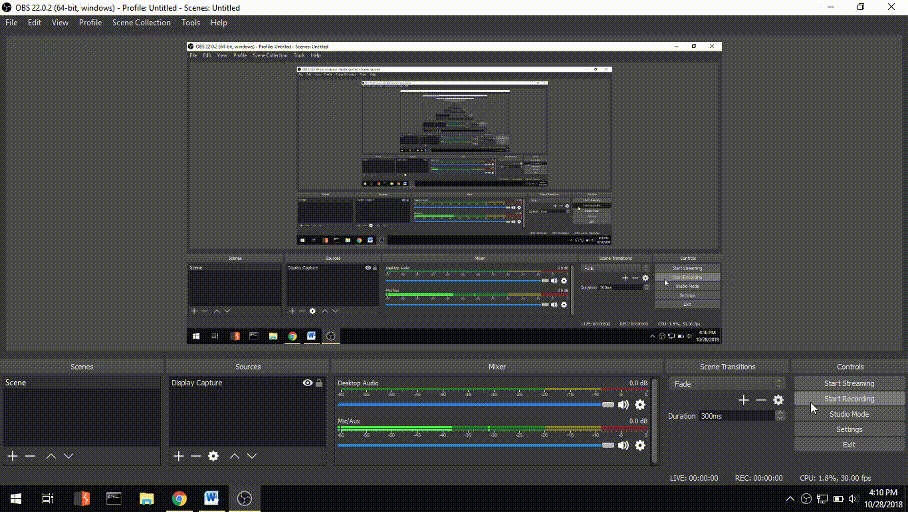
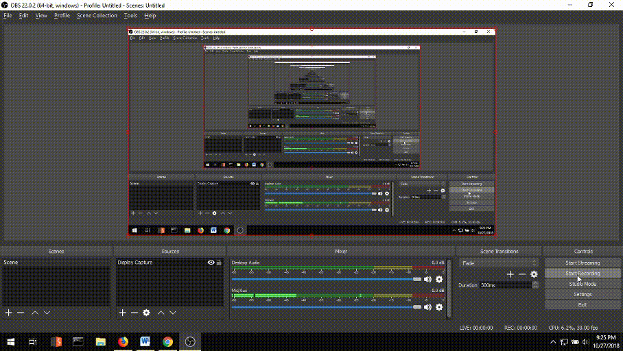
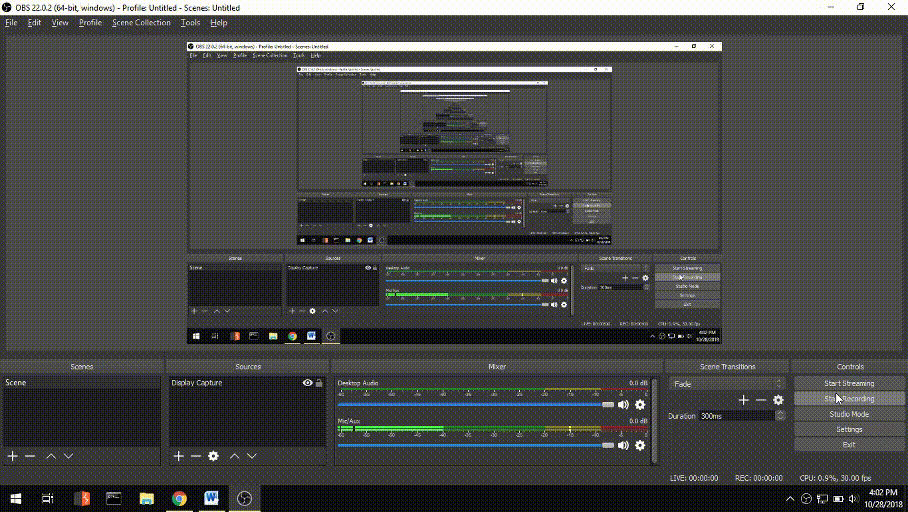
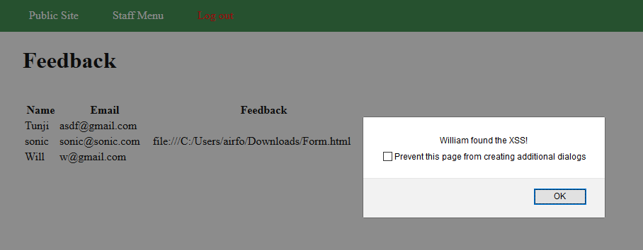
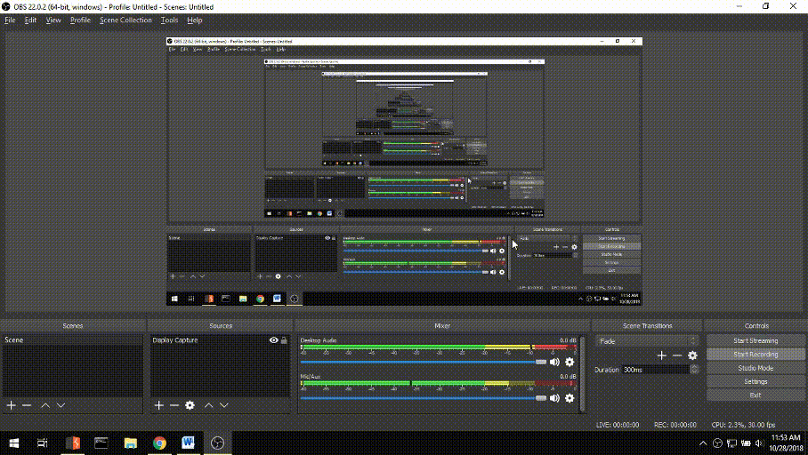
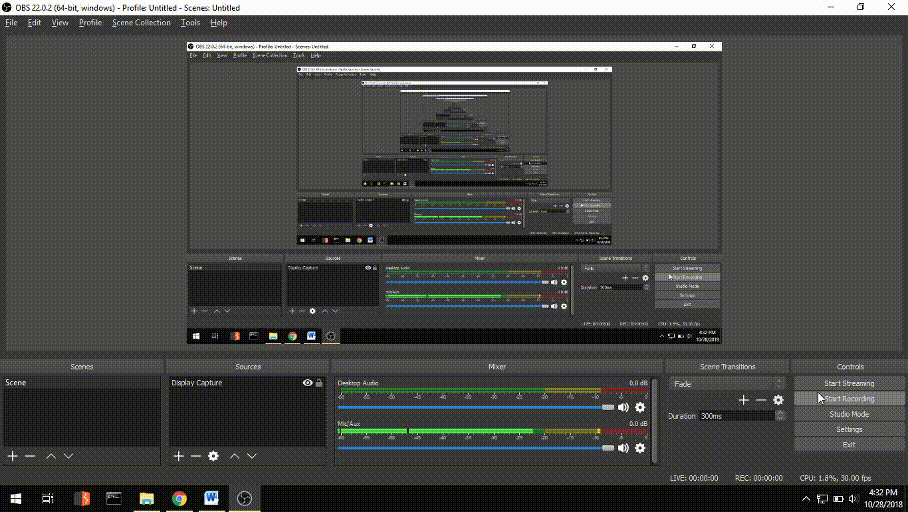

# Project 8 - Pentesting Live Targets

Time spent: **24** hours spent in total, since CodePath doesn't seem to understand that letting anyone change default login credentials is a good idea.

> Objective: Identify vulnerabilities in three different versions of the Globitek website: blue, green, and red.

The six possible exploits are:
* Username Enumeration
* Insecure Direct Object Reference (IDOR)
* SQL Injection (SQLi)
* Cross-Site Scripting (XSS)
* Cross-Site Request Forgery (CSRF)
* Session Hijacking/Fixation

Each version of the site has been given two of the six vulnerabilities. (In other words, all six of the exploits should be assignable to one of the sites.)

## Blue

Vulnerability #1: SQL Injection

This was essentially tedious testing using Burp’s Intruder module to attack numerous input forms and looking for the first one that correctly responded to my SLEEP(5) request. Since I had already finished the Red site, this took less time than I was worried about, but it was still tedious.

Vulnerability #2: Session Hijacking/Fixation

I performed a Session Hijacking attack. After logging into Red, Green, and Blue and grabbing the session ID from each site (by navigating to /hacktools/change_session_id.php) and then opening a separate browser, I navigated to each site’s change-session-id site again and then copied over the corresponding RGB session ID from the other session. After re-navigating to the login screen for all three sites, the Blue site granted me staff access.

## Green

Vulnerability #1: Username Enumeration

For each site, I entered in a wrong username / wrong password and right username / wrong password combination for each site looking for a difference. Only the Green site had a formatting change, indicating it was vulnerable to username enumeration.

Vulnerability #2: Cross-Site Scripting

To solve this one, I logged out of all three sites and then went to the Feedback form, submitting the following message in each site:

I then logged on to each site and then navigated to the Feedback section to find which site was weak to the cross-site scripting attack—as it turns out, it was the Green site.

## Red

Vulnerability #1: Insecure Direct Object Reference

I discovered that newly-created salespeople don’t actually appear in the Public Site’s “Find a Salesperson” section. Therefore, in the admin page of the Blue and Red users (not Green since I already found two weaknesses in it), I created a new salesperson and checked their ID (it was 12).

I then logged out of the staff page and navigated to the “Find a Salesperson” page, clicked on a salesperson, and then changed the ID to 12.

The Blue site redirected me to the Find a Salesperson page—while the Red site sent me to the newly created person (who isn’t normally listed on that page), indicating that Red is vulnerable to IDOR attacks.

Vulnerability #2: Cross-Site Request Forgery

I knew that CSRF had to be in Red since I had discovered all five previous vulnerabilities on the other sites, leaving only Red with one available vulnerability. I sent feedback into the user form with the filepath to an image.

I then logged onto red’s staff site, went to the feedback site, and then copied the file path, which correctly redirected me to the file—hence displaying Red’s weakness to CSRF attacks.

## Notes

Well, the fact that someone can change default login credentials and ruin it for everyone else wasn't exactly the best of ideas...
